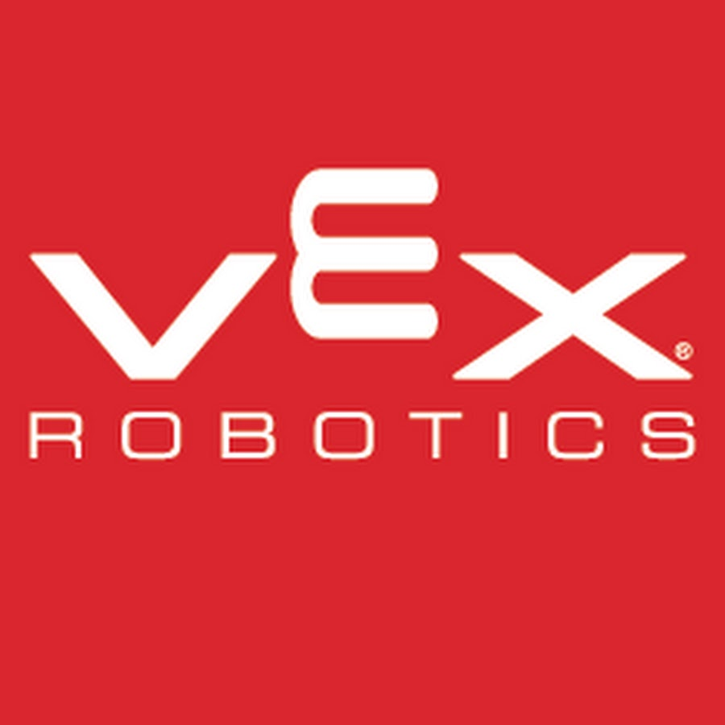

# Awesome VEX 

> A curated list of packages and resources regarding the VEX Robotics Competition (VRC).

## Contents

- [General](#general)
- [Suppliers](#suppliers)
- [Programming](#programming)
- [Electronics](#electronics)
- [Scouting](#scouting)
- [ENB](#ENB)
- [Community](#community)
- [Repositories](#repositories)
  - [Pros (C++/C#)](#pros)

## General

- [VRC Current Game Overview](https://www.vexrobotics.com/v5/competition/vrc-current-game) - Brief overview of this season's competition.
- [VRC Game Manual](https://content.vexrobotics.com/docs/21-22/tipping-point/GameManual-1.0.pdf) - Game manual for this season's competition.
- [VRC Hub App](https://www.vexrobotics.com/v5/competition/vrc-hub) - official competition companion for teams, spectators, and event planners involved in the VEX Robotics Competition!
- [The Compass Alliance](https://www.thecompassalliance.org/) - A resource for learning about all FRC topic, made for any level of experience.
- [State Space Guide](https://github.com/calcmogul/state-space-guide) - A practical guide to state-space control: graduate-level control theory for high schoolers.
- [GradleRIO](https://github.com/wpilibsuite/GradleRIO) - A powerful Gradle Plugin that allows teams competing in the FIRST robotics competition to produce and build their code.

## Suppliers

## Programming

## Scouting

- [VexDB](https://vexdb.io/) - Most up-to-date database for viewing information about VEX teams and events. Includes an API whuch is easy to use and well documented.

## ENB

## Community

- [/r/VEX](https://www.reddit.com/r/vex/) - The one and only VEX subreddit.
- [VEX Forum](https://www.vexforum.com/) - The essential forum for all things VEX.
- [Discord Server](https://discord.gg/naFgzsvB) - Chat community for robotics advice and socialization with other VEX students, mentors, and alumni, as well as direct access to vendors of VEX-related products. The absolute best place to go for VEX discussion.
- [Discord Server List](https://docs.google.com/spreadsheets/d/1MqwE_L4Z0RDf1Sn-dsfFZ7jBVD8bMkqPHGrqrejq_o0/edit) - List of unofficial regional, organizational, and community servers for VEX.

## Repositories
### Pros
- [pros](https://github.com/purduesigbots/pros) - Source code for PROS kernel: open source C/C++ development for the VEX V5 microcontroller
- [pros-cli](https://github.com/purduesigbots/pros-cli) - Command Line Interface for managing PROS projects. Works with V5 and the Cortex
- [pros-vsc](https://github.com/purduesigbots/pros-vsc) - PROS plugin for VS Code
- [OkapiLib](https://github.com/OkapiLib/OkapiLib) - A PROS library for programming VEX robots.
- [2020-annotated-robot-code](https://github.com/the7dorks/2020-annotated-robot-code) - All of the code used by 333A's robot in the 2020-2021 VRC Annotated Programming Skills Challenge.
- 
